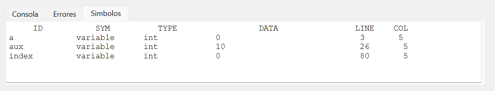

# ORGANIZACION DE LENGUAJES Y COMPILADORES 2 - Proyecto 1 - Manual Técnico

| Nombre                           | Carné                                      |
|:--------------------------------:|:------------------------------------------:|
| Erick Ivan Mayorga Rodríguez     | 201901758                                 	|

## INTRODUCCIÓN

Se realizo un compilador para un lenguaje de programación de alto nivel enfocado a la ciencia de datos utilizando Bison y Flex. Para la consola se utilizó Qt tomando en cuenta que se muestra tanto la ejecución del programa en consola, la tabla de errores, la tabla de símbolos y el árbol AST. 

## Ambiente del compilador

### Guardar variables, vectores, structs, y funciones

### Asignar variables

### Obtener variables, structs y funciones

### Tabla de símbolos

### Tabla de errores 

### Crear árbol AST en formato .dot

### Tipo de datos

### Símbolos

## Expresiones del compilador

### Acceso a Identificadores

### Operaciones aritméticas, relacionales y lógicas

### Acceso a vectores 

### Acceso a structs 

### Acceso a matrices 

### Función size 

### Función get 

### Función media 

### Función mediana 

### Función moda 

### Función iota 

### Función atof 

### Función atoi 

## Instrucciones del compilador
### Asignación de variables 

### Función main  

### Función If

### Función For

### Función While

### Función Printf

### Declaración de funciones

### Función pushback

### Función pushfront

### Función remove

### Función Return

### Función Break

### Función Continue

### Declaración de variables

### Creación de structs

## Interfaces del compilador
### Interfaz para las expresiones 

### Interfaz para las intrucciones 

## Parser 
### Análisis sintáctico 

### Análisis léxico

## Main en Qt 

## ParserCtx en Qt 

