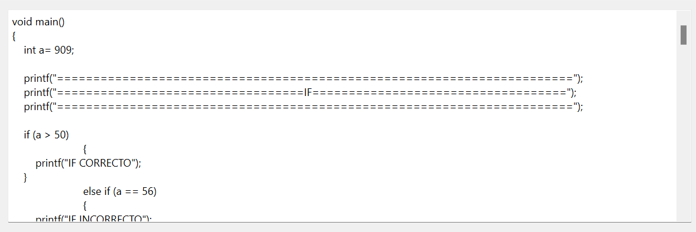

# ORGANIZACION DE LENGUAJES Y COMPILADORES 2 - Proyecto 1 - Manual de Usuario

| Nombre                           | Carné                                      |
|:--------------------------------:|:------------------------------------------:|
| Erick Ivan Mayorga Rodríguez     | 201901758                                 	|

## INTRODUCCIÓN

Mini OLc IDE es un entorno de desarrollo que provee herramientas para la escritura de programas en lenguaje mini OLc. Permite visualizar tanto la salida en consola de la ejecución del archivo fuente como los diversos reportes de la aplicación (errores, tabla de símbolos, AST). 

## Mini Olc Ide
La pantalla principal del entorno permite visualizar el archivo de entrada, junto con sus secciones de salida de consola, tabla de errores y tabla de símbolos. Se ejecuta el programa utilizando el botón "Ejecutar" y se muestra el árbol AST usando el botón "Mostrar AST".  
### Entorno de desarrollo 

Se debe colocar el archivo de entrada en el espacio arriba de la consola y después se debe presionar el botón de ejecutar para que compile el programa y verifique si existen errores.  
### Archivo de entrada

### Botón "Ejecutar"

La salida de la ejecución del archivo de entrada se observa en la consola. El entorno compila el programa y permite visualizar su salida si este no encuentra errores. 
### Consola 

Si el archivo no encuentra errores en la salida muestra un mensaje diciendo que la ejecución fue realizada correctamente. 
### Mensaje de salida ejecutada sin errores

Por el contrario, si encuentra algún tipo de error semántico o sintáctico muestra el error en la tabla de errores y muestra un mensaje diciendo que se encontraron errores en el programa. 
### Mensaje de salida ejecutada con errores  

Al encontrar un error este lo almacena en la tabla de errores. Estos se encuentran clasificados en errores semánticos y sintácticos, además brinda información importante como la línea y columna en el archivo de entrada en donde se encuentra el error y el mensaje descriptivo del error. 
### Tabla de errores

Si logra ejecutar correctamente el programa, almacena todas las variables guardadas y las muestra en la tabla de símbolos. 
### Tabla de símbolos

Además, si se desea observar el árbol AST que describe el programa ejecutado se debe presionar el botón "Mostar AST" para que lo muestre en una ventana externa.
### Botón "Mostrar AST"

